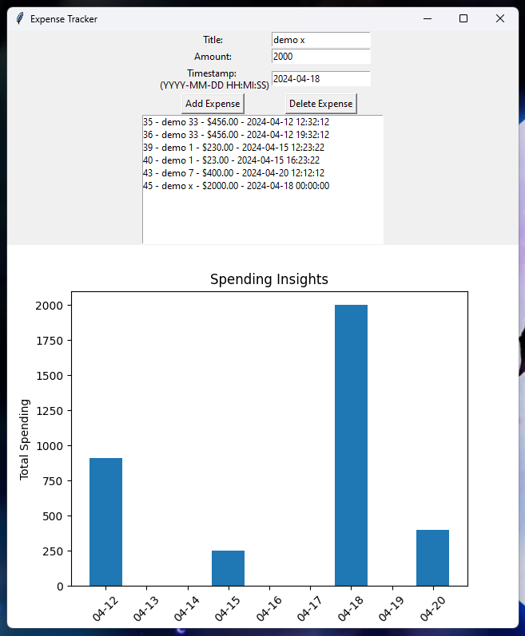

<h1 color="cyan"> Expenses Tracker</h1>

This is a simple expense calculator which combines all expenses that you did in a day

<h2>Created Using: </h2>
<ul>
  <li>Python </li>
  <li>SQL</li>
  <li>Matplotlib</li>
  <li>Tkinter</li>
</ul>
<h2>Screenshot </h2>

<h2>To Use </h2>

Replace Username and Password with local mysql server Username and Password

 <h3>Requirements:</h3>

install the libraries using 

<ul>
  <li>pip install matplotlib tkinter numpy mysql-connector-python </li>
</ul>
